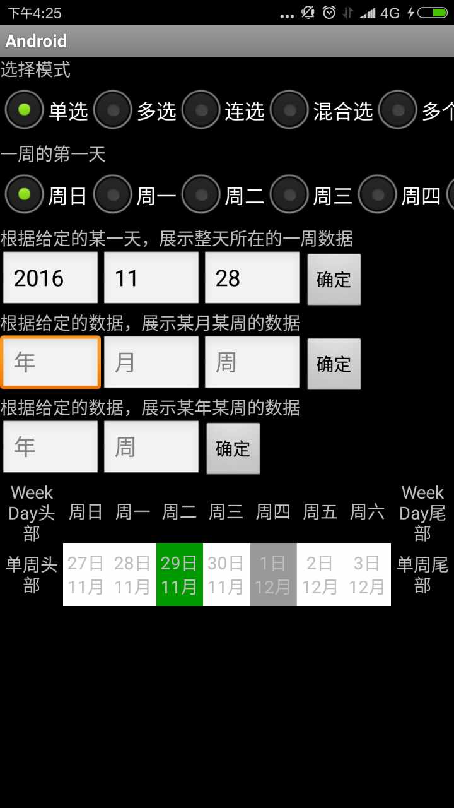
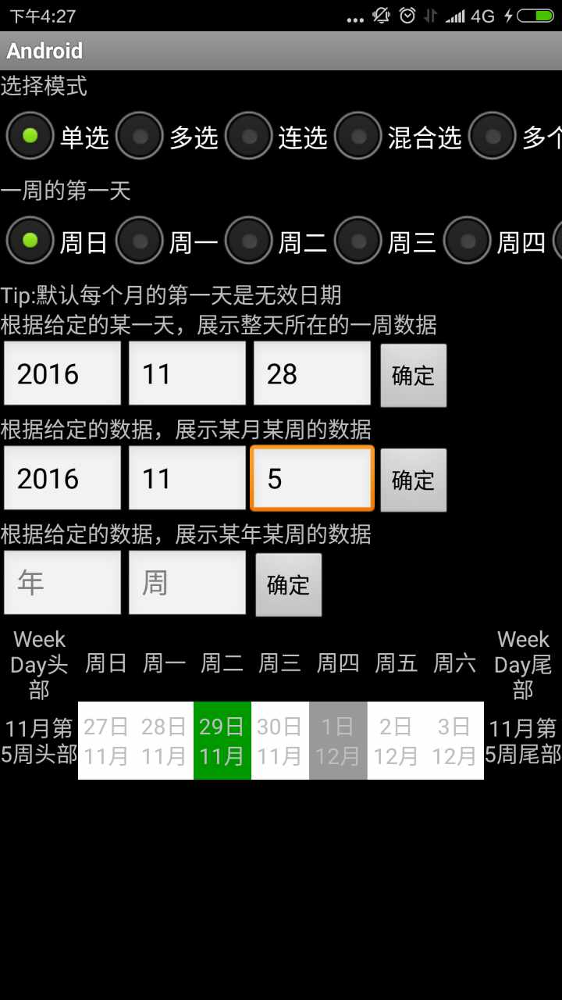
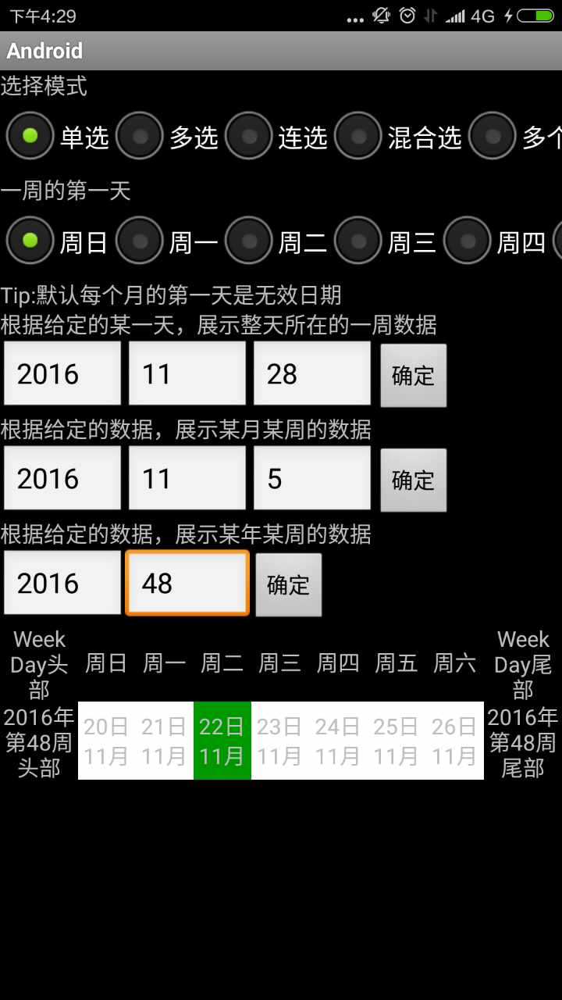
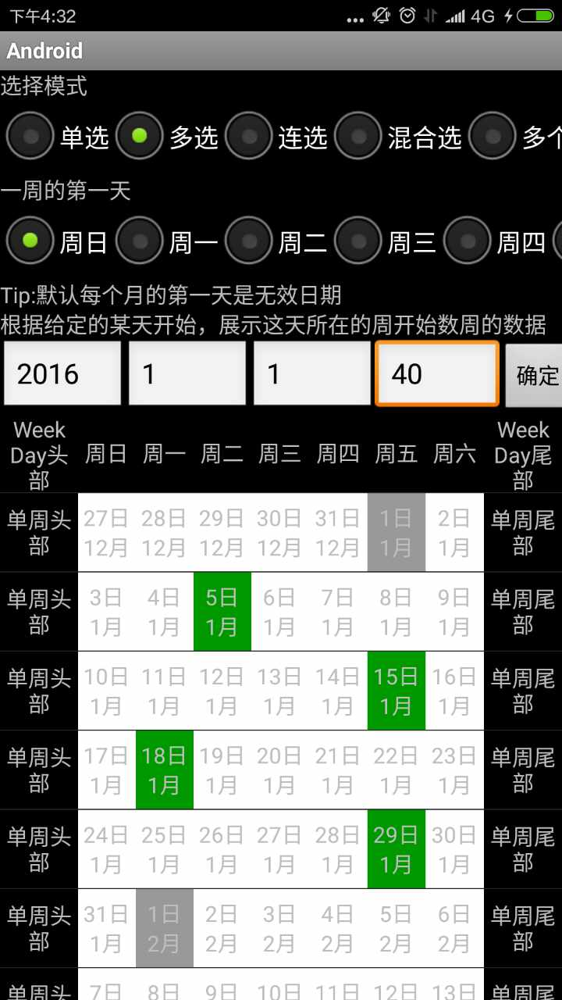
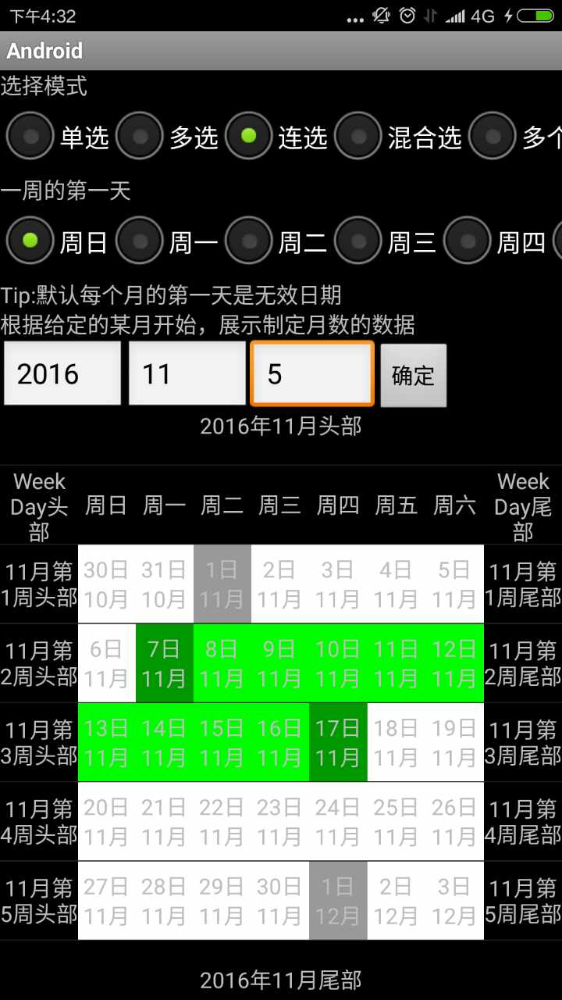
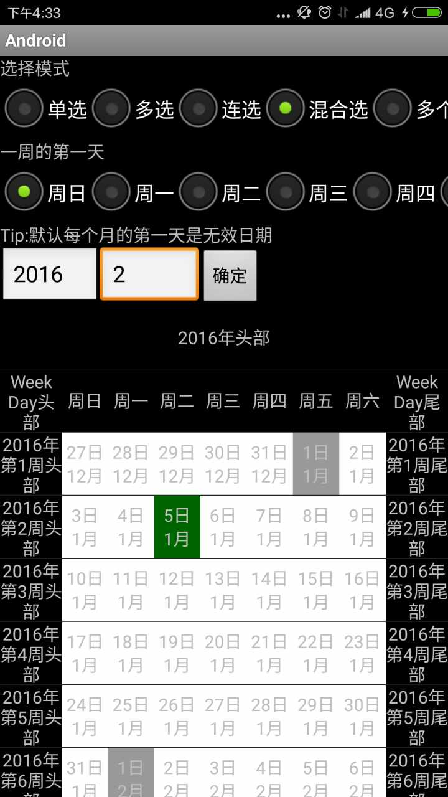
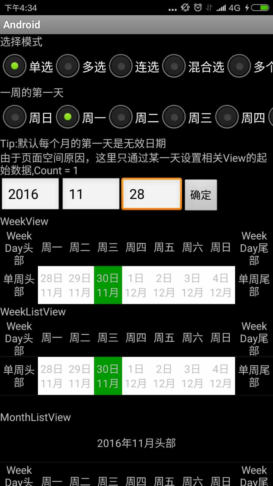

# Calendar
## 概述
+   该库是Android日历选择库；
+   支持单选，多选，连选，混合选（起始日期和结束日期可以是同一天），多个连选，多个混合选；
+   支持一周第一天的设置，日期数据也会随着改变，默认周日是一周的第一天；
+   支持多个ICalendarView之间数据（选择数据）同步；内部ICalendarView分为几类：单周
（WeekView），周历（WeekListView），月历（MonthListView）年历（YearListView），
CalendarManager可以管理多个ICalendarView，做到数据（选择）同步；
+   支持上层定制UI，包括DayCell，周头部，周尾部，月头部，月尾部，年头部，年尾部
+   支持上层定制数据处理策略，内部针对每种选择模式，定义了一到两种选择处理策略（详见DayCellClickPolicyImp)
+   定制交互还处于开发阶段（Click，LongClick，Touch等等），目前默认支持Click交互方式，
有好的想法可以联系我1716263268@qq.com

## 页面展示
    内部有Demo页面，分别针对单周，周历，月历，年历，多个控件数据同步，垂直分页周历（扩展）和水平分页月历（扩展）

### 单周
    指定任意一天，展示该天所在的一周数据

    指定某年某月某周，展示该周数据

    指定某年某周，展示该周数据

### 周历
    指定任意一天，展示该天所在的周开始，任意周数的数据

### 月历
    指定某年某月，展示从该月开始，任意数月的数据

### 年历
    指定某年，展示从该年开始，任意年数的数据

### 多控件选择数据同步
    CalendarManager可以同时管理多个ICalendarView，ICalendarView之间数据同步

